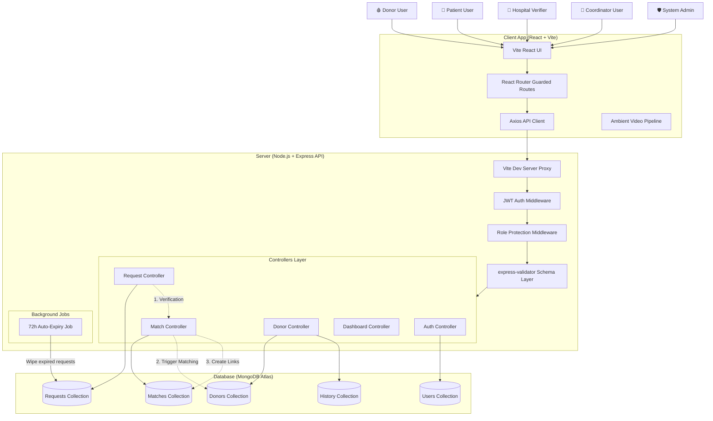
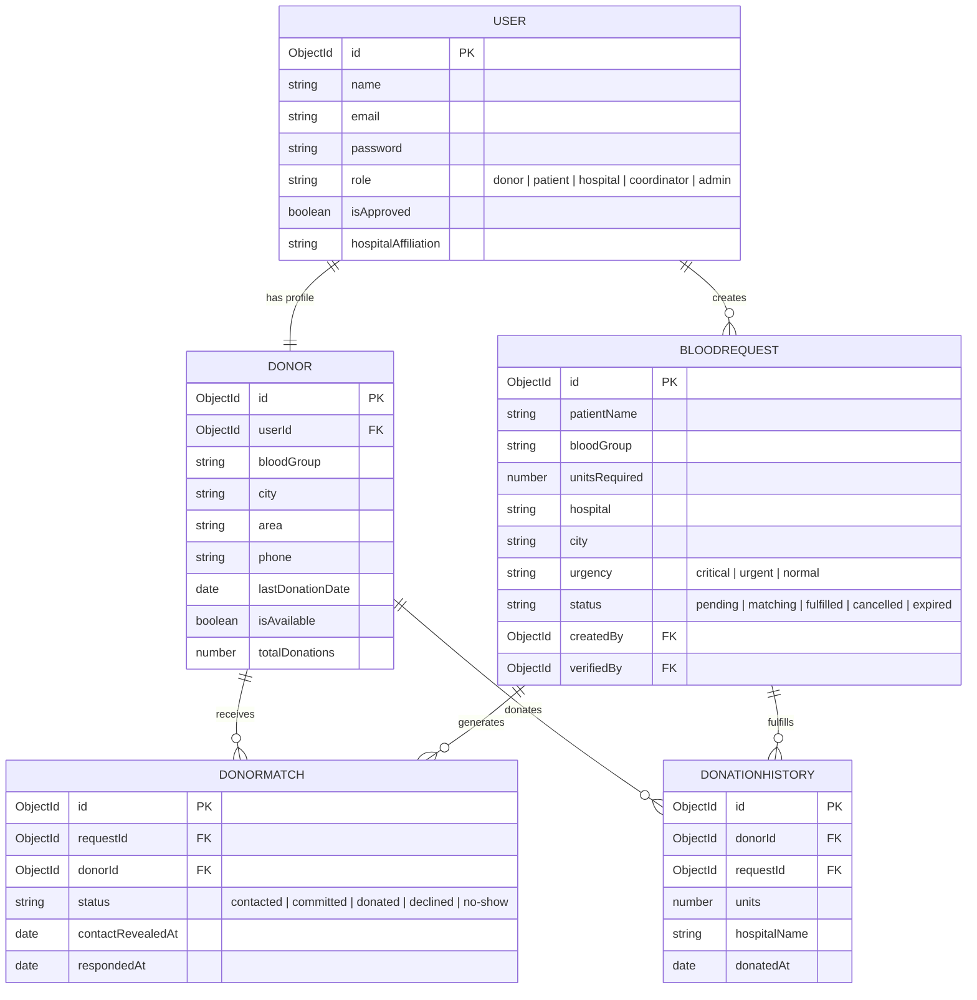
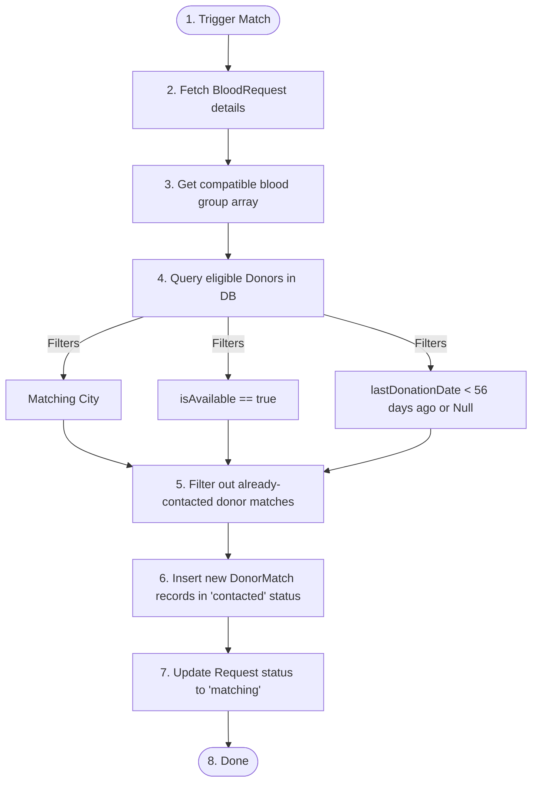

# LifeLink — System Architecture

This document outlines the software architecture, database design, and key execution engines of the **LifeLink Blood Donation Emergency Matching System**.

---

## 🗺️ System Overview Diagram

Below is the end-to-end architecture diagram representing the client interfaces, API middleware route guards, backend controllers, and background schedulers:

---

## 🎨 1. Frontend Architecture (React + Vite)

The frontend is a single-page React app bundled with Vite, styled with custom utilities on top of Tailwind CSS, and animated using Framer Motion:

*   **Guarded Routes (`App.jsx`):** Employs role-based protection using `ProtectedRoute`. If an unauthenticated user or user with an unauthorized role tries to access dashboard routing, they are immediately redirected to `/login` or `/unauthorized`.
*   **Theme and Layouts (`DashboardLayout.jsx`):** Renders dynamic sidebars using matching icons and navigation lists tailored per role. Loads the ambient background video pipeline (`Donate.mp4` for donors, `patient.mp4` for patients) to provide an immersive dark theme UI.
*   **Header Notifications (`NotificationBadge.jsx`):** Polled in the background every 30 seconds for active matching requests. Displays a pulsing indicator notifying the donor if a request matches their criteria.
*   **API Client Layer (`api/index.js`):** Modularizes endpoints into Axios resource groups (`authAPI`, `donorAPI`, `requestAPI`, `matchAPI`, `dashboardAPI`). Configured with request interceptors to auto-attach authorization JWTs, and response interceptors to handle `401 Unauthorized` logouts globally.

---

## ⚙️ 2. Backend Architecture (Express REST API)

The backend is structured around a classic layered architecture:

*   **Routing Guards (`routes/`):** Restricts access to sensitive endpoints. For instance:
    *   `/api/match/` endpoints require `authorize('admin', 'coordinator', 'hospital')`.
    *   `/api/donors/requests` endpoints require `authorize('donor')`.
*   **Validation Layer (`express-validator`):** Validates all input schemas (e.g., verifying blood group codes, email domains, password complexity constraints) before reaching controller functions.
*   **Controllers (`controllers/`):** Manages core business logic, database queries, and exception handling.

---

## 🗄️ 3. Database Schema Design (Mongoose)

MongoDB stores models with explicit relational links (`ObjectIDs`):

---

## ⚡ 4. Core Algorithms & Automation Engines

### A. The Matching Engine
Triggered automatically when a hospital/admin verifies a request, or manually via "Re-run Matching":

### B. Auto-Expiry Background Job
To maintain queue hygiene and prevent false alerts, the server boots up an interval worker:
- **Frequency:** Runs every 30 minutes.
- **Action:** Queries `BloodRequest` where `status` is not completed (`'fulfilled'`, `'cancelled'`, `'expired'`) and the current timestamp exceeds `expiresAt` (default 72 hours from creation).
- **Status Shift:** Automatically marks matched requests as `expired`, removing them from circulating donor feeds.
